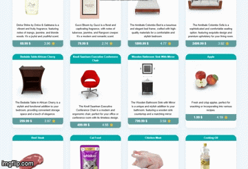
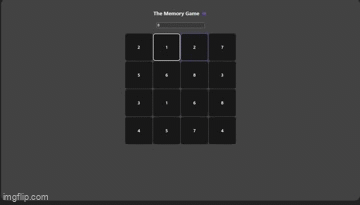
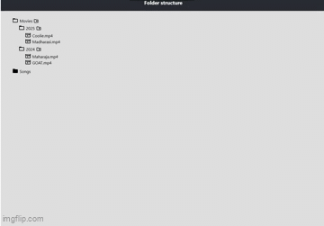

# ⚛️ React Learning Projects

A collection of React projects built while learning React.

---

## 🔁 Infinite Scrolling

> Infinite scroll implementation using React hooks

---

## 🧠 Memory Game

> Classic memory card flip game built with React

---

## 📁 React Folders

> React folder structure and component organization

---

## 🛠️ Tech Stack

